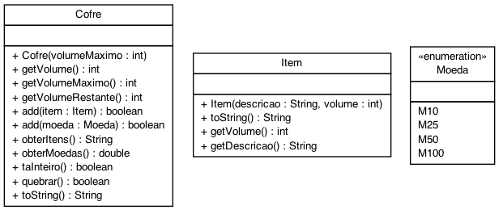

# Cofre

- [Requisitos](#requisitos)
- [Diagrama](#diagrama)
- [Exemplo de execução](#exemplo-de-execução)
- [Relatório de Entrega](#relatório-de-entrega)


## Requisitos

O sistema deverá:

- Gerenciar um cofrinho do tipo Porquinho capaz de guardar moedas e itens.
- As moedas devem ser criadas através de uma `enum`.
- Itens tem uma descrição.
- Ambos moedas e itens tem um atributo volume.
- Ao criar um cofre deve-se informar o seu volume máximo.
  - O volume máximo de um cofre não pode ser alterado.
- Ao criar um cofre o seu volume deve ser vazio ( igual 0).  
- O volume do cofre incrementa conforme ele recebe itens e moedas.
- Deve ser possivel saber quanto de volume livre o cofre tem  
- Funcionamento do cofre:
    - Para inserir moedas e itens o cofre deve estar inteiro.
      - O volume do item/moeda tem que ser menor ou igual ao volume sobrando no cofre
    - Para obter moedas e itens o cofre deve estar quebrado.
    - Ao obter moedas e itens, os atribuitos `valor` e `itens` do porco devem ser zerados.

## Diagrama



## Exemplo de execução 

````java
public class Runner {

    public static void main(final String[] args) {

        Cofre cofre = new Cofre(20);
        System.out.println(cofre); //Cofre{volume=0/20, inteiro=true, moedas=0.0, itens='vazio'}
        cofre.add(Moeda.M10);
        cofre.add(Moeda.M50);
        System.out.println(cofre); //Cofre{volume=4/20, inteiro=true, moedas=0.6, itens=''}

        cofre.add(new Item("ouro", 3));
        System.out.println(cofre); //Cofre{volume=7/20, inteiro=true, moedas=0.6, itens='ouro'}

        cofre.add(new Item("passaporte", 2));
        System.out.println(cofre); //Cofre{volume=9/20, inteiro=true, moedas=0.6, itens='ouro, passaporte'}

        if (cofre.obterItens() == null) {
            System.out.println("Voce deve quebrar o cofre primeiro"); //Voce deve quebrar o cofre primeiro
        }

        if( cofre.obterMoedas() == -1){
            System.out.println("Voce deve quebrar o cofre primeiro"); //"Voce deve quebrar o cofre primeiro"
        }
        System.out.println(cofre); //Cofre{volume=9/20, inteiro=true, moedas=0.6, itens='ouro, passaporte'}

        cofre.quebrar();
        cofre.quebrar();

        System.out.println(cofre.obterItens());  //ouro, passaporte
        System.out.println(cofre.obterMoedas()); //0.6
        System.out.println(cofre); //Cofre{volume=9/20, inteiro=false, moedas=0.6, itens='ouro, passaporte, '}

    }
}

````

## Relatório de Entrega

Não esqueça de preencher o seguinte formulário [Link para formulário](https://forms.gle/J99Y6cUHamTYU17y7) ao completar a atividade.
